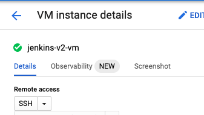
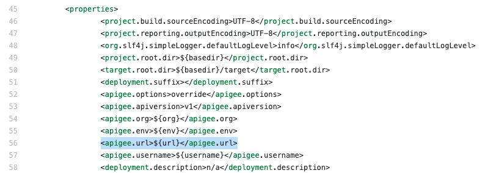

#TODO w/ Token

docker run \
  -p 8081:8080 \
  -e APIGEE_TOKEN="$(gcloud auth print-access-token)" \
  -e APIGEE_ORG="teodlh-apigeex-342821" \
  -e APIGEE_TEST_ENV="eval" \
  -e APIGEE_PROD_ENV="prod" \
  -e TEST_HOST="apigeex.dlhdemo.com" \
  -e GCP_SA_AUTH="token" \
  -e API_VERSION="google" \
  -e JENKINS_ADMIN_PASS="password" \
  apigee/devrel-jenkins:latest
  
 Update plugins (docker will exit)
 docker start
 Create pipeline build
 - Git repo: https://github.com/apigee/devrel.git
 - script path: references/cicd-pipeline/ci-config/jenkins/Jenkinsfile
 Start Build
 
 #TODO w/ credential file
 
export SERVICE_ACCOUNT_ID=jenkins-apigee-service-acocunt
export PROJECT_ID=teodlh-apigeex-342821
export KEY_FILE_PATH=/tmp/keys/jenkins-key-file.json

gcloud iam service-accounts keys create $KEY_FILE_PATH \
--iam-account=$SERVICE_ACCOUNT_ID@$PROJECT_ID.iam.gserviceaccount.com 
cat $KEY_FILE_PATH

 docker run -d \
  --name jenkinsv2 \
  -p 8082:8080 \
  -e APIGEE_TOKEN="$(gcloud auth print-access-token)" \
  -e APIGEE_ORG="teodlh-apigeex-342821" \
  -e APIGEE_TEST_ENV="eval" \
  -e APIGEE_PROD_ENV="prod" \
  -e TEST_HOST="apigeex.dlhdemo.com" \
  -e GCP_SA_AUTH="vm-scope" \
  -e API_VERSION="google" \
  -e JENKINS_ADMIN_PASS="password" \
  -e GOOGLE_APPLICATION_CREDENTIALS="$KEY_FILE_PATH" \
  -v ${KEY_FILE_PATH}:${KEY_FILE_PATH}:ro \
  apigee/devrel-jenkins:latest
  

# Deploy Jenkins and Configure Jenkins
1. Deploy Jenkins from [GCP Marketplace](https://pantheon.corp.google.com/marketplace/product/click-to-deploy-images/jenkins)
	1. A sample production scale ready deployment of Jenkins can be found [here](https://cloud.google.com/architecture/using-jenkins-for-distributed-builds-on-compute-engine)
1. After the VM is successfully deployed, SSH into the VM. GCP console provides an easy way to do this from the Compute Engine view
	1. 

## Install nodejs, npm, and Maven
nodejs, npm, and maven are needed by the build process. Install them using the commands below.
```
$sudo apt install nodejs
$sudo apt install npm
$sduo apt install maven
```
  
# Setup Github repo
Next we'll create our own Github repo and copy a working CICD reference implementation into it.

1. [Create a github repo](https://docs.github.com/en/get-started/quickstart/create-a-repo)
1. Setup Git repo locally
```
$ export GIT_URL=https://github.com/username/repo.git
$ cd $home
$ mkdir cicd-demo
$ cd cicd-demo
$ git init
$ git remote add origin $GIT_URL
$ git add .
$ git commit -m "initial commit"
```

## Copy CICD Reference implementation

```
$ mkdir devrel
$ git pull https://github.com/apigee/devrel.git
$ cp ~/devrel/references/cicd-pipeline/. ~/cicd-demo/reponame/. -a -r
$ cd ~/cicd-demo/reponame
$ git add .
$ git commit -m "Adding devrel cicd reference"
$ git push`
 ```
# Configure GCP IAM
Next, we'll configure a service account with permissions to Apigee to be used by the build proces.

**Perform the steps below in the [Google Cloud Shell](https://shell.cloud.google.com)**

1. Create service account for Jenkins
```
$ gcloud auth login
$ export SERVICE_ACCOUNT_ID=jenkins-apigee-service-acocunt
$ export PROJECT_ID=<your-project>
$ gcloud iam service-accounts create $SERVICE_ACCOUNT_ID \
--description="Jenkins service account" \
--display-name="jenkins-appigee-service-account"   
$ gcloud projects add-iam-policy-binding $PROJECT_ID \
--member="serviceAccount:$SERVICE_ACCOUNT_ID@$PROJECT_ID.iam.gserviceaccount.com" \
--role="roles/apigee.admin"
```
*To use a different role, see roles available  or create a [custom role](https://cloud.google.com/iam/docs/understanding-custom-roles) *

## Update Jenkins VM to use new service account and additional scopes
The default service account and scopes must be updated in the Jenkins VM so that the API calls to Apigee complete successfully. More information on scopes can be found [here](https://cloud.google.com/compute/docs/access/create-enable-service-accounts-for-instances#changeserviceaccountandscopes) this is a [best practice](https://cloud.google.com/compute/docs/access/create-enable-service-accounts-for-instances#best_practices).

```
export VMNAME=jenkins-1-vm
export VMZONE=us-central1-a
gcloud compute instances stop $VMNAME --zone=$VMZONE
gcloud compute instances set-service-account $VMNAME --service-account $SERVICE_ACCOUNT_ID@$PROJECT_ID.iam.gserviceaccount.com  --scopes cloud-platform --zone=$VMZONE
gcloud compute instances start $VMNAME --zone=$VMZONE

```

## Optional: Use a Key File for authentication
The maven plugin supports the use of a key-file if needed.

1. Create a [key-file](https://cloud.google.com/iam/docs/creating-managing-service-account-keys). T
```
$ gcloud iam service-accounts keys create ./jenkins-key-file.json \
--iam-account=$SERVICE_ACCOUNT_ID@$PROJECT_ID.iam.gserviceaccount.com 
$ cat ./jenkins-key-file.json
```
1. Copy the contents of the key-file your clipboard

For the step below, make sure you're in the **Jenkins SSH terminal**

1. Create a key-file and paste the contents from clipboard
```
$ touch ./jenkins-key-file.json
$ vi ./jenkins-key-file.json
```
1. In the vi editor, type **i** to enter insert mode
1. Paste in the contents from the clipboard using ctrl+v


1. Press escape to exit insert mode. Type **:wq** to save and exit vi
1. Verify the contents of the key-file
`$ cat ./jenkins-key-file.json`


# Configure Jenkins
1. Go to http://<jenkins ip / url>/pluginManager/
1. Click on Available, and install the plugins below. 
    1. Pipeline
    3. cucumber reports
    4. git
    5. html publisher
    6. junit
    7. matrix project
    8. script security
    9. token macro 
    10. configuration as code
    11. workflow aggregator
1. Choose to 'Install without restart'

## Configure global variables
1. Go to http://<jenkins ip / url>/configure
1. Scroll down to Global properties and check off Environment variables
	1. Add **ID_File** as **/path-to-key-file.json**
	3. Add **APIGEE_ENV, APIGEE_ORG, and APIGEE_URL** and set the values to your match your Apigee deployment


## Configurie Jenkins credentials

The Jenkinsfile provided expects a credentials object to exist:
	APIGEE_CREDS = credentials('apigee')
https://www.jenkins.io/doc/book/using/using-credentials/#adding-new-global-credentials 

## Configure Jenkinsfile 
This configuration sets the maven profile to use Apigee X management API (GoogleAPI) and authenticate using an the IAM service account created previously
1. In the GitHub repo, eidt the file /ci-config/jenkins/Jenkinsfile
1. Find the section that begins with **mvn clean install** and replace it with the code below
```
$mvn clean install \
-P"googleapi" \
-Denv="${env.APIGEE_ENV}" \
-Dorg="${env.APIGEE_ORG}" \
-Durl="${env.APIGEE_URL}" \
-Dbearer="$(gcloud auth print-access-token)" \
-Ddeployment.suffix="${env.APIGEE_DEPLOYMENT_SUFFIX}" \
-Ddeployment.description="Jenkins Build: ${env.BUILD_TAG} Author: ${env.AUTHOR_EMAIL}"
```


*The example above authenticates using the service account. 
Alternatively, you can authenticate using the keyfile by replacing -Dbearer="..." with -Dsa="${env.ID_File}"*

## Configure Maven
Configure the maven profile to use custom apigee url
1. Edit pom.xml
1. Find the `<properties>` section
1. Add `<apigee.url>${url}</apigee.url>`


1. Find the plugin section `<groupId>com.google.code.maven-replacer-plugin</groupId>`
1. Replace 
```
<token>org-env.apigee.net</token>
<value>${apigee.org}-${apigee.env}.apigee.net</value>
```
with 
``` 					
<token>org-env.apigee.net</token>
<value>${apigee.url}</value>
```


# Create Jenkins Deployment
1. In the Jenkins web interface, click on New Item


2. Enter a name, select 'Pipeline', and click OK


3. Under **Pipeline** set
   1. **Definition**: Pipeline script from SCM
   2. **SCM**: Git
   3. **Repository URL**: path to the Github repo created above
   
	
   4. **Script Path**: ci-config/jenkins/Jenkinsfile
   
	
6. Scroll down and click **Save**
7. Back at the Apigee-Pipeline status, click on **Build Now**


8. The status page will show the stages of the build and the result


