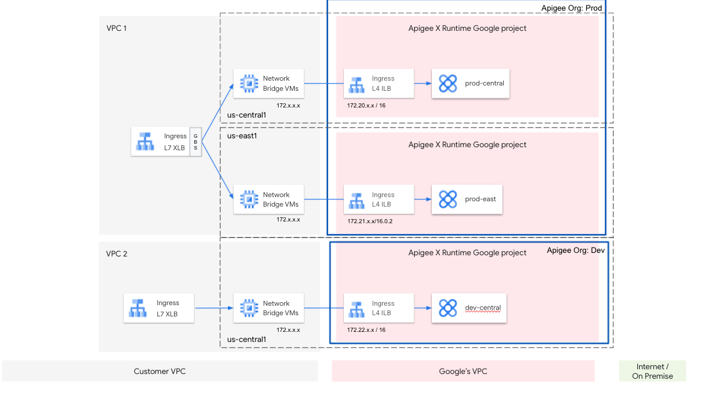

# Overview

# Set Environment Variables

//Be careful the below doesn't conflict with MIG in 1st region  
export AUTH="Authorization: Bearer $(gcloud auth print-access-token)"  
export SERVICE_PROJECT_ID="teodlh-apigeex"  
export HOST_PROJECT_ID="host-project"  
export NEW_REGION_LOCATION="us-west2"  
export NETWORK_NAME=default  
export MIG_NAME=apigee-mig-us-$NEW_REGION_LOCATION  
export VPC_SUBNET=default  

//Get the internal IP address of the Apigee instances  
curl -X GET -H "$AUTH" \
  "https://apigee.googleapis.com/v1/organizations/$SERVICE_PROJECT_ID/instances"

//Set APIGEE_ENDPOINT to the 2nd region's internal IP address from above.  
export APIGEE_ENDPOINT=10.107.76.2

# MIG Template

gcloud compute instance-templates create $MIG_NAME \
  --project $SERVICE_PROJECT_ID \
  --region $NEW_REGION_LOCATION \
  --network $NETWORK_NAME \
  --subnet $VPC_SUBNET \
  --tags=https-server,apigee-mig-proxy,gke-apigee-proxy \
  --machine-type e2-medium --image-family debian-10 \
  --image-project debian-cloud --boot-disk-size 20GB \
  --metadata ENDPOINT=$APIGEE_ENDPOINT,startup-script-url=gs://apigee-5g-saas/apigee-envoy-proxy-release/latest/conf/startup-script.sh

## If using a shared VPC  
Network should be:projects/<your Apigee Host Project>/global/networks/<your-shared-vpc>. 
Subnet should be: projects/<your Apigee Host Project>/regions/<your-gcp-region>/subnetworks/<your-shared-subnet>. 
Note: A unique tag is used for the MIG in the 2nd region. This is optional and meant to facilitate controlling the firewall rules for 2nd mig separately. To use the same firewall rul as the 1st mig, replace apigee-proxy-$NEW_REGION_LOCATION with gke-apigee-proxy (the tag used in the standard setup)
  
gcloud compute instance-templates create $MIG_NAME \
  --project $SERVICE_PROJECT_ID \
  --region $NEW_REGION_LOCATION \
  --no-address \
  --network projects/$HOST_PROJECT_ID/global/networks/$NETWORK_NAME \
  --subnet projects/$HOST_PROJECT_ID/regions/$NEW_REGION_LOCATION/subnetworks/$VPC_SUBNET \
  --tags=https-server,apigee-mig-proxy,apigee-proxy-$NEW_REGION_LOCATION \
  --machine-type e2-medium --image-family debian-10 \
  --image-project debian-cloud --boot-disk-size 20GB \
  --metadata ENDPOINT=$APIGEE_ENDPOINT,startup-script-url=gs://apigee-5g-saas/apigee-envoy-proxy-release/latest/conf/startup-script.sh

# Create MIG
  
gcloud compute instance-groups managed create $MIG_NAME \
  --project $SERVICE_PROJECT_ID --base-instance-name apigee-mig \
  --size 2 --template $MIG_NAME --region $NEW_REGION_LOCATION

gcloud compute instance-groups managed set-autoscaling $MIG_NAME \
  --project $SERVICE_PROJECT_ID --region $NEW_REGION_LOCATION --max-num-replicas 20 \
  --target-cpu-utilization 0.75 --cool-down-period 90

gcloud compute instance-groups managed set-named-ports $MIG_NAME \
  --project $SERVICE_PROJECT_ID --region $NEW_REGION_LOCATION --named-ports https:443

# Firewall Rules
Optional Per the notes in the MIG template creation step, this is optional for 2nd region. fw rule from 1st region setup can be used.
  
gcloud compute firewall-rules create allow-lb-to-apigee-mig-$NEW_REGION_LOCATION \
  --description "Allow incoming from GLB on TCP port 443 to Apigee Proxy" \
  --project HOST_PROJECT_ID --network $NETWORK_NAME --allow=tcp:443 \
  --source-ranges=130.211.0.0/22,35.191.0.0/16 --target-tags=apigee-proxy-$NEW_REGION_LOCATION

# Add Backend Service to XLB
gcloud compute backend-services add-backend apigee-proxy-backend \
  --project $SERVICE_PROJECT_ID --instance-group $MIG_NAME \
  --instance-group-region $NEW_REGION_LOCATION \
  --balancing-mode UTILIZATION --max-utilization 0.8 --global
